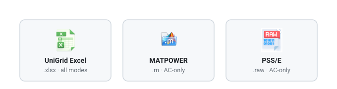
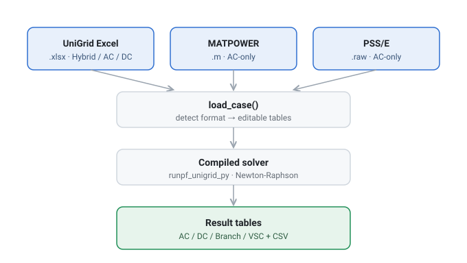

# UniGrid — ACDC Power Flow (Python)

> AC · DC · hybrid AC/DC power flow — one compiled package, three input formats.



**UniGrid** is a power flow solver for AC, DC, and hybrid AC/DC grids, compiled from
MATLAB and callable from Python. Point it at a grid file — a UniGrid Excel (`.xlsx`),
a MATPOWER m-file (`.m`), or a PSS/E raw file (`.raw`) — and it loads the grid as
editable tables and runs the power flow. The solve mode (AC/DC Hybrid, AC-only, or
DC-only) is detected automatically from the input. Works on both Windows and macOS
(the matching compiled package is selected automatically).

## How it works



## Quick start

**1. One-time setup** (finds/installs Python 3.12 and the dependencies):

- **macOS** — in a terminal, from this folder: `bash setup_mac.sh`
- **Windows** — double-click `setup_windows.bat`

**2. Open this folder** in your editor (VS Code: File → Open Folder).
On macOS it auto-uses the environment that setup created.

**3. Open `run_unigrid.py`, edit the SETTINGS block at the top, and press Run (▶).**

```python
# Pick a grid — keep ONE line without the leading "#":
GRID = "grids/ACDC_matacdc_case24_ieee_rts1996_3zones.xlsx"   # AC/DC Hybrid
# GRID = "grids/ACDC_matacdc_stagg5_droop.xlsx"               # AC/DC Hybrid
# GRID = "grids/matpower_ieee14.m"                            # MATPOWER  → AC-only
# GRID = "grids/matpower_ieee118.m"                           # MATPOWER  → AC-only
# GRID = "grids/psse_ieee14.raw"                              # PSS/E     → AC-only
# GRID = "grids/psse_ieee118.raw"                             # PSS/E     → AC-only
# GRID = "grids/psse_3w_sample.raw"                           # PSS/E, 3-winding → AC-only
```

The mode is picked automatically from the file, so you only choose the grid. The
results print in the terminal (AC / DC / branch / VSC tables, whichever the mode
produces) and are saved as CSV files under `results/`.

**Example run** — `ACDC_matacdc_stagg5_droop.xlsx` (a 5-bus AC / 3-bus DC hybrid grid):

```text
grid                : ACDC_matacdc_stagg5_droop.xlsx
mode                : AC/DC Hybrid
baseMVA             : 100.0
AC buses            : 5
AC voltage min/max  : 0.9916 / 1.06 pu
DC buses            : 3
DC voltage min/max  : 0.9978 / 1.0079 pu
detailed VSC        : yes

===== AC bus result =====
 Bus   VM[pu]  Freq[pu]  Angle[deg]  Gen_P[MW]  Gen_Q[MVAR]  Load_P[MW]  Load_Q[MVAR]  toAC_P[MW]  toAC_Q[MVAR]  baseKV[kV]  Vmin[pu]  Vmax[pu]
 1.0 1.060000       1.0    0.000000 133.646211    84.320296         0.0           0.0    0.000000         0.000       345.0       0.9       1.1
 2.0 1.000000       1.0   -2.383696  40.000000   -34.828749        20.0          10.0  -59.994973       -40.000       345.0       0.9       1.1
 3.0 1.000000       1.0   -3.894980   0.000000     0.000000        45.0          15.0   20.754183        -0.854       345.0       0.9       1.1
 4.0 0.998420       1.0   -4.305740   0.000000     0.000000        40.0           5.0    0.000000         0.000       345.0       0.9       1.1
 5.0 0.991565       1.0   -4.163943   0.000000     0.000000        60.0          10.0   34.995017         5.000       345.0       0.9       1.1

===== DC bus result =====
 Bus   VM[pu]  VM_norm[pu]  Gen_P[MW]  Load_P[MW]  toDC_P[MW]  baseKV[kV]  Vmin[pu]  Vmax[pu]
 6.0 1.007913     0.079131        0.0         0.0   58.622356       345.0       0.9       1.1
 7.0 1.000003     0.000034        0.0         0.0  -21.902085       345.0       0.9       1.1
 8.0 0.997788    -0.022119        0.0         0.0  -36.180474       345.0       0.9       1.1

(the branch and VSC tables print as well, and every table is saved to results/*.csv)
```

## Input formats & modes

UniGrid picks the solver mode automatically from whatever file `GRID` points to:

| Input file | Contains | Mode |
|------------|----------|------|
| UniGrid Excel `.xlsx` | AC, DC, and interlinking-converter tables | **Hybrid, AC-only, or DC-only** — as set by the file's `Mode` sheet |
| MATPOWER `.m` | AC network only | **AC-only** |
| PSS/E `.raw` | AC network only | **AC-only** |

`.m` and `.raw` are converted to UniGrid tables in Python at load time
(see `unigrid_convert.py`); no separate Excel-conversion step is needed.

## Requirements

- **MATLAB Runtime R2024b** for your OS (free). If full MATLAB R2024b is installed,
  it is already included. Otherwise download it from
  https://www.mathworks.com/products/compiler/matlab-runtime.html
- **Python 3.9 – 3.12** (3.13+ is not supported). The setup script handles this for you.

## Changing the grid and settings

Everything you normally change lives in the **SETTINGS block** at the top of
`run_unigrid.py` — edit it and press Run (▶):

- **Different grid** → switch the `GRID` line, or point it to your own UniGrid
  `.xlsx` (same sheet layout as the files in `grids/`), a MATPOWER `.m`, or a
  PSS/E `.raw`.

For finer changes (individual buses, generators, lines), either **edit the grid file
directly** (that file *is* the input), or add a line after the case is loaded, e.g.
`case.AC_gen_dat.iloc[0, 5] *= 1.2`. Editable tables include `AC_PLoad_dat`,
`AC_gen_dat`, `AC_Line_dat`, `IC_dat`, `DC_PLoad_dat`, and more.

To run **many scenarios at once**, see `run_unigrid_scenarios.py` — a template that
loops over parameter values; adapt it to your own study.

## Example inputs (`grids/`)

AC/DC test systems used in the paper (UniGrid Excel), across three scales
(**ICs** = interlinking converters, the stations that link the AC and DC sides):

| Grid file | Category | AC / DC buses | ICs |
|-----------|----------|---------------|-----|
| `ACDC_matacdc_case24_ieee_rts1996_3zones.xlsx` | Transmission | 50 / 7 | 7 |
| `ACDC_matacdc_stagg5_droop.xlsx` | Transmission | 5 / 3 | 3 |
| `ACDC_CIGRE_Benchmark.xlsx` | Distribution | 14 / 11 | 3 |
| `ACDC_71bus_3IC_parallel.xlsx` | Microgrid | 38 / 33 | 3 |
| `ACDC_12bus_paper.xlsx` | Microgrid | 6 / 6 | 1 |

Plus five AC-only inputs that show the other supported formats:

| Input file | Format | System | Mode |
|------------|--------|--------|------|
| `matpower_ieee14.m` | MATPOWER | IEEE 14-bus | AC-only |
| `matpower_ieee118.m` | MATPOWER | IEEE 118-bus | AC-only |
| `psse_ieee14.raw` | PSS/E | IEEE 14-bus | AC-only |
| `psse_ieee118.raw` | PSS/E | IEEE 118-bus | AC-only |
| `psse_3w_sample.raw` | PSS/E | 40-bus, three-winding transformer | AC-only |

The IEEE 14 and IEEE 118 systems are provided in **both** MATPOWER and PSS/E form, so
you can confirm the two importers agree on the same network.

Sources for these examples are listed under [Acknowledgements](#acknowledgements).

## Files

| File | Role |
|------|------|
| **`run_unigrid.py`** | ▶ Edit the SETTINGS block and run this |
| `run_unigrid_scenarios.py` | Loop / scenario example (a template to adapt) |
| `setup_mac.sh` / `setup_windows.bat` | One-time setup (Python + deps) |
| `run_mac.sh` / `run_windows.bat` | Run from the terminal (alternative to ▶) |
| `load_case.py` | Engine: load a grid (`.xlsx` / `.m` / `.raw`) into editable tables |
| `unigrid_convert.py` | Convert a MATPOWER `.m` / PSS/E `.raw` into UniGrid tables |
| `acdc_engine.py` | Engine: run the power flow (auto-selects the OS package) |
| `_mac_worker.py` | Internal helper used on macOS only |
| `grids/` | Example inputs (Excel, MATPOWER, PSS/E) |
| `unigrid_pkg_win/` | Compiled solver for Windows (all modes) |
| `unigrid_pkg_mac/` | Compiled solver for macOS (all modes) |
| `docs/` | README figures |

<details><summary>Manual setup (without the scripts)</summary>

macOS (mwpython needs a real Python 3.9–3.12 venv):
```bash
python3.12 -m venv .venv
.venv/bin/python -m pip install pandas openpyxl
.venv/bin/python run_unigrid.py
```
Windows:
```bat
py -m pip install .\unigrid_pkg_win\for_redistribution_files_only
py -m pip install pandas openpyxl
py run_unigrid.py
```
</details>

## Acknowledgements

The bundled example inputs come from established, openly documented test systems:

- **`matpower_ieee14.m`, `matpower_ieee118.m`** — IEEE 14-bus and 118-bus test cases,
  distributed with [MATPOWER](https://matpower.org) (BSD-3-Clause) as `case14` /
  `case118`, converted from the University of Washington power-system test-case archive.
- **`psse_ieee14.raw`, `psse_ieee118.raw`** — IEEE 14-bus and 118-bus test systems
  (public IEEE test-case data), expressed in PSS/E raw format.
- **`psse_3w_sample.raw`** — adapted from a Siemens **PSS®E** sample case (PSS®E-33),
  included here only to demonstrate three-winding transformer import. PSS®E is a
  registered trademark of Siemens.
